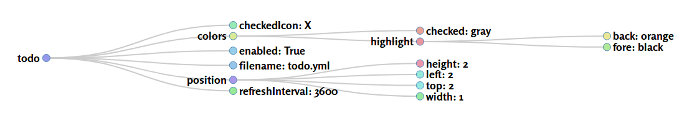

# [yamlvisual.py](https://github.com/7h3rAm/)

This script will help you visualize a simple YAML file as a D3 graph. Check sample report for more details.

## Usage:

```bash
$ python yamlvisual.py
USAGE: yamlvisual.py <file.yaml>
$
$ python yamlvisual.py todo.yaml
$
```
## Screenshot:


## Credits:

* [D3](https://d3js.org/)
* [jQuery](https://jquery.com/)
* [Mike Bostock’s Blocks](https://bl.ocks.org/mbostock)
* [SHA256-geraintluff](https://github.com/geraintluff/sha256)
* [ColorHash-zenozeng](https://github.com/zenozeng/color-hash)
* [Rob Schmuecker’s Block 7880033](http://bl.ocks.org/robschmuecker/7880033)
